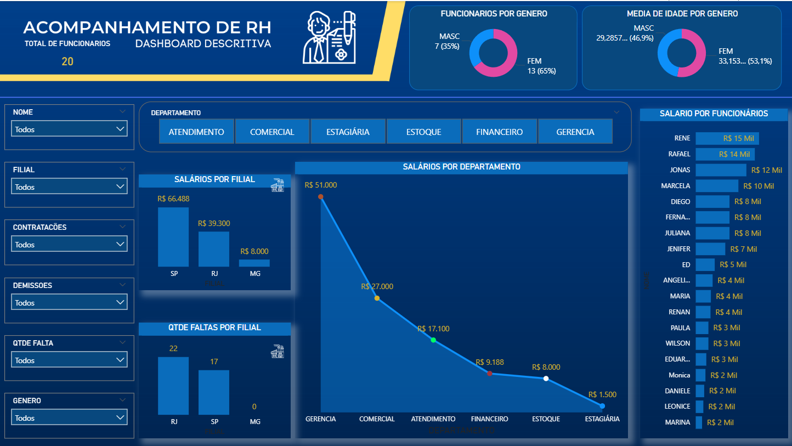

# 💼 Dashboard de Recursos Humanos em Power BI  
**Human Resources Analytics Dashboard - Power BI**

📊 *Análise descritiva, indicadores estratégicos e design orientado à decisão.*

---

## 🧭 Sobre o Projeto  

Projeto desenvolvido como parte do curso de **Power BI** ministrado por **Danilo Maciel** na plataforma **Udemy**, com o objetivo de aplicar técnicas de **análise descritiva, modelagem de dados** e **visualização executiva** em um cenário corporativo simulado.  

O resultado é um **painel de RH interativo**, projetado para sintetizar informações operacionais e estratégicas sobre o quadro de funcionários.  

---

## 📘 Contexto  

O dashboard representa o **painel de controle de Recursos Humanos** de uma empresa fictícia, consolidando métricas essenciais como:  

- 👥 Quantidade total de funcionários  
- 💰 Gastos por funcionário, departamento e filial  
- ⚖️ Distribuição por gênero e idade  
- 📉 Controle de faltas, contratações e demissões  

O design prioriza **clareza visual, eficiência e interatividade**, com **filtros dinâmicos** e **segmentações** que permitem explorar dados em tempo real.  

---

## ✨ Destaques Técnicos  

🔹 **Visualização consolidada** dos principais KPIs de RH  
🔹 **Filtros e segmentações intuitivas**, oferecendo controle total da análise  
🔹 **Cálculos DAX personalizados** para métricas e indicadores comparativos  
🔹 **Pipeline ETL no Power Query** — limpeza, transformação e integração de dados  
🔹 **Design corporativo** com paleta institucional em azul e amarelo  

---

## 🧠 Principais Aprendizados  

Durante o desenvolvimento, foram aplicadas práticas essenciais de **Business Intelligence**:

- Estruturação de **modelo de dados relacional**
- Preparação e limpeza com **Power Query**
- Criação de **medidas DAX** e indicadores dinâmicos  
- Aplicação de **design data-driven** (foco na clareza e usabilidade)
- Compreensão do **processo completo de ETL**

---

## 🧰 Tecnologias Utilizadas  

| Categoria | Ferramentas |
|:-----------|:------------|
| **BI & Visualização** | Power BI Desktop |
| **Transformação de Dados** | Power Query |
| **Cálculos & KPIs** | DAX |
| **Base de Dados** | Excel (Tabela_Rh.xlsx) |

---

## 🗂️ Estrutura dos Arquivos  

| Arquivo | Descrição |
|:---------|:-----------|
| `Dash_Rh.pbix` | Arquivo principal do Power BI |
| `Tabela_Rh.xlsx` | Base de dados utilizada no projeto |
| `assets/dashrh_screenshot.png` | Captura de tela do dashboard |

---

## 🖼️ Visual do Dashboard  

  

> 🎨 *Interface intuitiva, com hierarquia visual clara e narrativa analítica focada em insights de RH.*

---

## 🚀 Aplicabilidade  

Embora criado para fins educacionais, este projeto demonstra práticas aplicáveis a **ambientes reais de negócios**, como:  
- Monitoramento de indicadores de pessoas  
- Análise de custos e produtividade  
- Gestão de diversidade e absenteísmo  
- Apoio à tomada de decisão estratégica  

---

## 💬 Feedbacks & Contribuições  

Ficarei feliz em receber **sugestões, críticas ou insights de melhoria**.  
Contribuições são bem-vindas via *issues* ou *pull requests*. 🚀  

---

### ✍️ Dev Quote  
> “Simplicity is the soul of efficiency.”  
> - *Austin Freeman*

---

